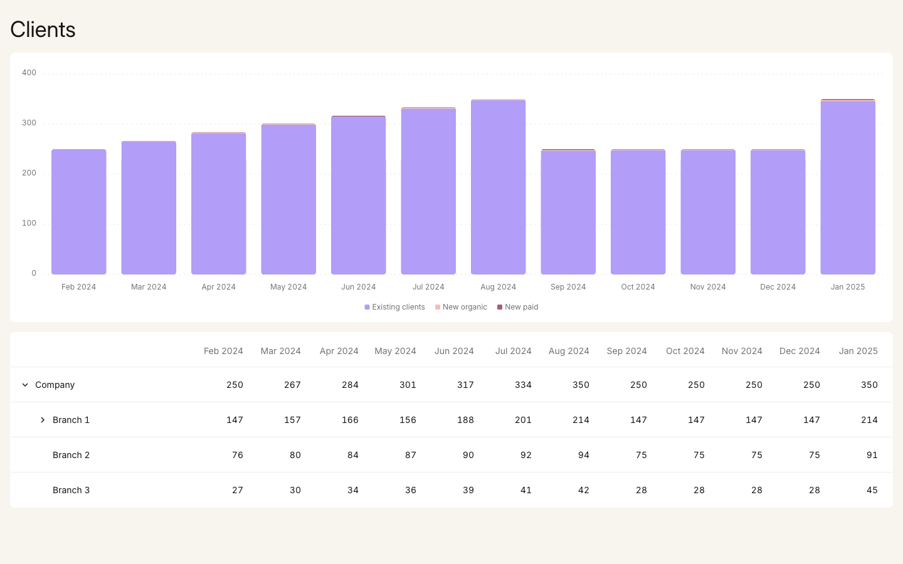

# Clients dashboard

**Live demo: [book-of-business.inovozenko.workers.dev](https://book-of-business.inovozenko.workers.dev/)**

A frontend home assignment. One page shows how the book of business develops: a stacked bar chart of
clients per month split by acquisition channel, and a monthly table whose rows expand from the company down to
branches, advisers and channels.



The Figma mockup at the same size is in [docs/screenshots/figma-mockup-2.png](docs/screenshots/figma-mockup-2.png).

## Where I made a call

The brief left parts open on purpose. My answers are further down this README:

- [Assumptions and deviations from the design](#assumptions-and-deviations-from-the-design): what the page does
  differently from the design or the brief, and why.
- [Notes on the assignment](#notes-on-the-assignment): where the payload and the design disagree, with the numbers.
- [Open questions](#open-questions): what I would ask you about the brief and the data.

Every technical decision, with its reasons and its cost, is recorded in the ADR, along with the order of work:
[in English](docs/ADR.md), translated from the [Russian original](docs/ADR.ru.md).

## Run it

You need Node.js 24 (see `.nvmrc`).

```sh
npm install
npm run dev
```

`npm run dev` starts Vite on http://localhost:5173 and the API on port 3001; Vite proxies `/api` to it.

To run what a deployment would run, build the client and start the Node server. It serves both the API and the
built page on one port, 3001 unless `PORT` says otherwise:

```sh
npm run build
npm start
```

The address takes two optional parameters, read once on load and passed to the API as they are: `dataset`
(default `assignment`) and `year` (only `2024` exists, which is also the default).

### Datasets for the demo

Each row opens the page on one dataset, in the live demo or locally with `npm start` running; with `npm run dev`,
use port 5173 instead.
Every dataset is a JSON file in [server/src/data](server/src/data) with the structure of the brief: the company
holds branches, a branch employees, an employee channels, and at any level the data is either there in that shape
or missing.

| Dataset | What it shows | Demo | Local |
|---|---|---|---|
| `assignment` | The payload from the brief, unchanged. The default. | [/](https://book-of-business.inovozenko.workers.dev/) | [/](http://localhost:3001/) |
| `empty` | A company with no clients in any month and nothing below it. | [?dataset=empty](https://book-of-business.inovozenko.workers.dev/?dataset=empty) | [?dataset=empty](http://localhost:3001/?dataset=empty) |
| `full` | Five branches and 37 advisers, each with all three channels; every total adds up. Existing clients build up month by month from the new ones. | [?dataset=full](https://book-of-business.inovozenko.workers.dev/?dataset=full) | [?dataset=full](http://localhost:3001/?dataset=full) |
| `no-employees` | Branches without advisers: two without the key, one with an empty list. | [?dataset=no-employees](https://book-of-business.inovozenko.workers.dev/?dataset=no-employees) | [?dataset=no-employees](http://localhost:3001/?dataset=no-employees) |
| `no-channels` | Branches and advisers, no channel breakdown anywhere. | [?dataset=no-channels](https://book-of-business.inovozenko.workers.dev/?dataset=no-channels) | [?dataset=no-channels](http://localhost:3001/?dataset=no-channels) |
| `partial-channels` | Channels for some advisers only, some with part of them, and a channel the design does not know, Referral. | [?dataset=partial-channels](https://book-of-business.inovozenko.workers.dev/?dataset=partial-channels) | [?dataset=partial-channels](http://localhost:3001/?dataset=partial-channels) |
| `empty-categories` | Everybody left in some months: whole months at zero, a channel at zero in one month and one all year. | [?dataset=empty-categories](https://book-of-business.inovozenko.workers.dev/?dataset=empty-categories) | [?dataset=empty-categories](http://localhost:3001/?dataset=empty-categories) |
| `single-level` | The company alone, with clients. | [?dataset=single-level](https://book-of-business.inovozenko.workers.dev/?dataset=single-level) | [?dataset=single-level](http://localhost:3001/?dataset=single-level) |
| `long-names` | Long names, Cyrillic and accented letters, two advisers with the same name and a long channel name. | [?dataset=long-names](https://book-of-business.inovozenko.workers.dev/?dataset=long-names) | [?dataset=long-names](http://localhost:3001/?dataset=long-names) |
| `large-numbers` | Five- and six-digit client counts. | [?dataset=large-numbers](https://book-of-business.inovozenko.workers.dev/?dataset=large-numbers) | [?dataset=large-numbers](http://localhost:3001/?dataset=large-numbers) |
| `inconsistent-totals` | Totals that do not add up, and channels above their adviser and, in Jun and Jul 2024, above the company. | [?dataset=inconsistent-totals](https://book-of-business.inovozenko.workers.dev/?dataset=inconsistent-totals) | [?dataset=inconsistent-totals](http://localhost:3001/?dataset=inconsistent-totals) |

### States of the page

The `scenario` parameter makes the API answer so that each state shows; it combines with `dataset`, as in
[?dataset=full&scenario=slow](https://book-of-business.inovozenko.workers.dev/?dataset=full&scenario=slow).

| State | What happens | Demo | Local |
|---|---|---|---|
| Loading | The API holds the answer for two seconds: a skeleton in place of the chart and the table, then the data. | [?scenario=slow](https://book-of-business.inovozenko.workers.dev/?scenario=slow) | [?scenario=slow](http://localhost:3001/?scenario=slow) |
| No data | The API has nothing for the request: it answers `[]` at once, or 404 for an unknown dataset, year or scenario. The chart keeps its axes and months and the table its header, both saying "No client data"; there is no Retry. | [?scenario=empty-response](https://book-of-business.inovozenko.workers.dev/?scenario=empty-response), [?year=2023](https://book-of-business.inovozenko.workers.dev/?year=2023), [?dataset=unknown](https://book-of-business.inovozenko.workers.dev/?dataset=unknown) | [?scenario=empty-response](http://localhost:3001/?scenario=empty-response), [?year=2023](http://localhost:3001/?year=2023), [?dataset=unknown](http://localhost:3001/?dataset=unknown) |
| Error | The API answers 500 after two seconds, so the skeleton shows first. The chart keeps its axes and months, the table its header with the message and Retry under it. Retry shows the skeleton again and, with the scenario still in the address, the same error. To see Retry bring the data back, block `/api/clients` in DevTools (Network, Block request URL), reload, unblock it and press Retry. | [?scenario=error](https://book-of-business.inovozenko.workers.dev/?scenario=error) | [?scenario=error](http://localhost:3001/?scenario=error) |
| A year with no clients | Not "no data": the company is there with zeros. The table shows them; the chart keeps its 0–4 axis and says "No clients in this period". | [?dataset=empty](https://book-of-business.inovozenko.workers.dev/?dataset=empty) | [?dataset=empty](http://localhost:3001/?dataset=empty) |

## Deploy the demo

The demo runs at https://book-of-business.inovozenko.workers.dev. The same Hono app runs on Cloudflare Workers,
which serves the built page as static assets and sends everything else, including `/api/*`, to the app.

GitHub Actions ([.github/workflows/ci.yml](.github/workflows/ci.yml)) checks every push to `main` and every pull
request: lint, type check, unit tests, `wrangler deploy --dry-run` and the E2E suite. When they pass on `main`,
it deploys the demo, then checks that the demo serves this build and that `/api/clients` answers. The deploy
reads two repository secrets, `CLOUDFLARE_API_TOKEN` and `CLOUDFLARE_ACCOUNT_ID`.

By hand, `npm run deploy` builds the client and deploys; it needs Cloudflare credentials (`wrangler login`, or the
same two variables). `npx wrangler deploy --dry-run` checks the bundle without them.

## Test it

```sh
npm run format                    # applies the code style (eslint --fix)
npm run lint
npm run typecheck
npm test                          # Vitest: unit and component tests with coverage
npx playwright install chromium firefox webkit   # once, for the E2E suite
npm run test:e2e                  # Playwright on the production build
```

- **Unit tests** cover the pure functions in `client/src/lib`: the payload check and normalisation, the chart
  data, the value axis and the month labels. The coverage threshold for that folder is 100% of lines, branches
  and functions, and `npm test` fails below it.
- **Component tests** (React Testing Library, user-event) cover expanding and collapsing by click, by the
  expand button and by the arrow keys and Enter, `aria-level` and `aria-expanded`, rows without children,
  loading, the no-data and error states for every kind of answer, and Retry.
- **The API** has route tests for every dataset, the scenarios, and unknown datasets, years and scenarios.
- **E2E** runs one scenario per dataset from the shared list: it opens every level from the keyboard, compares
  the rows and the chart legend and axis with expectations written by hand next to the fixtures, runs axe on
  the expanded page and closes everything again. `e2e/states.spec.ts` answers the page with `[]`, `null`, 204,
  `{}`, a body that is not JSON, a 500 and an HTML 404, and covers the scenarios and Retry. Separate tests cover
  a 375px screen, hover and the row animations. The keyboard and focus scenarios run in Chromium, Firefox and
  WebKit, since focus handling differs between engines.

## How it is built

| Area | Choice |
|---|---|
| Client | React 19, TypeScript in strict mode, Vite |
| Table | React Aria Components `Table` with tree rows |
| Chart | Recharts 3 with `BarStack` |
| Styles | CSS Modules and design tokens as CSS custom properties; Inter from Fontsource |
| State | Local React state; one GET per page load |
| API | Hono on Node.js (`@hono/node-server`) |
| Tests | Vitest, React Testing Library, Playwright, axe |

```
client/src/
  api/clients.ts          the request, nothing else
  lib/                    pure functions: payload check, chart data, axis, month labels
  components/ui/          generic: TreeTable, StackedBarChart, Card, Avatar, Skeleton
  hooks/                  useLoadingIndicator: when the skeleton shows
  features/clients/       the domain: ClientsDashboard, ClientsChart, ClientsTable, useClients
server/src/
  app.ts                  API routes
  node.ts                 Node entry: the API plus the built client
  data/                   the assignment payload, fixtures and expectations for E2E
shared/clients.ts         the API contract used by both sides
e2e/                      Playwright scenarios
```

`components/ui` knows nothing about clients; `features/clients` maps the data onto it. The two main components:

```tsx
<TreeTable
  aria-label="Clients by month"
  rowHeaderLabel="Name"
  columns={columns}                 // { id, header }[]
  rows={[root]}                     // { id, children? }[]
  getRowTextValue={(node) => node.name}
  renderRowHeader={(node) => …}     // name and avatar
  renderCell={(node, column) => …}
  defaultExpandedKeys={[root.id]}   // or expandedKeys + onExpandedChange
/>

<StackedBarChart
  aria-label="Clients per month by acquisition channel"
  categories={months}               // string[]
  series={series}                   // { id, label, color, values }[], bottom to top
/>
```

**Data.** The API serves the payload from the brief unchanged. The client checks its structure and turns it into
one recursive node, `{ id, name, kind, values, children }`, so any node may hold branches, employees or
channels at any depth. One violation anywhere, such as a duplicate id or a `values` array that is not 12
non-negative numbers, puts the page into the error state instead of drawing part of the tree. An error while
rendering the chart or the table shows the same state rather than a blank page. An answer with nothing in it is
not an error: for a 404 that names an unknown dataset, year or scenario, for `[]`, `null` or no body, the page
says there is no data and offers no Retry, since asking again gives the same answer.

**Accessibility.** The table is a native `<table role="treegrid">` with `aria-level`, `aria-posinset`,
`aria-setsize` and `aria-expanded`, all from React Aria. Up and Down move between rows, Right expands and Left
collapses, Enter toggles, Home and End jump to the first and last row, and a click anywhere on a row with
children toggles it too. Tab and Shift+Tab also step from row to row and leave the table after the last one; the
treegrid pattern would make the whole table a single tab stop, but reviewers reach for Tab first.

Focus stays on rows and is never lost. A click focuses its row rather than the cell under the pointer, so the
arrow keys carry on from there. Coming back into the table with Tab starts at the first row, and with Shift+Tab at
the last. Rows that are animating out cannot take focus and are skipped, and if focus is inside a branch that
closes, it moves to the row that closed.

The first column has a name for screen readers although its header is empty on screen. The chart's SVG is one image
with a text name, its legend is a plain list, and the table holds the same numbers. While loading, the content is
marked `aria-busy` and a status message says so, which screen readers announce after Retry. Retry keeps focus
while the error stays on screen, and hands it to the page heading when the skeleton or the answer replaces it. Errors use `role="alert"`. Animations stop under `prefers-reduced-motion`.

**Layout.** At 1440px the page matches the Figma frame in positions and sizes, within a pixel of text
rendering; bar heights follow the data rather than the hand-drawn bars of the mockup. The two screenshots above
can be compared directly. As in the design, the name column is fixed and the month columns share the rest of the
width, so the table fits whether or not a scroll bar takes some of it; the page keeps room for a classic scroll
bar, so nothing jumps when it appears. On narrower screens the chart shrinks and its month labels thin out at an
even step that always keeps the first month, and the table scrolls inside its card with the name column pinned
from 768px. Nothing overflows the page down to 375px.

## Assumptions and deviations from the design

**No expand arrow on rows without children.** The design shows the arrow on every level except channels, including
Branch 2, Branch 3 and all advisers, and in the prototype clicking it does nothing. A control that does nothing
misleads mouse, keyboard and screen reader users alike, and a treegrid leaf must not have `aria-expanded`. The
indent is kept so names stay aligned. Every row, with or without children, still highlights on hover as in the
design: it helps to follow a row across twelve months.

**The year is part of the address.** The payload has no dates; the months Feb 2024 – Jan 2025 exist only in the
design. `/?year=2024` asks the API for that reporting year and the client labels 12 months from February of it.
Without the parameter the year is 2024. The rule "the period starts in February" is a constant in `shared/`;
the API should return the period with the data.

**What the chart shows.** The design splits every bar by channel across the whole company, but the payload has
channels for one adviser only, so that split cannot come from the data. The chart starts from the company totals,
which the payload has: New organic and New paid are the channels found in the data, and Existing clients is the
company value minus those. For the assignment data that gives Existing clients 250, 266, 282, 299, 315, 331, 348,
247, 248, 248, 248, 346. Bar heights match the Company row and the legend matches the design. The cost: Existing
clients in the chart is computed, it includes every client whose channel is unknown, and the New segments are
0–2 clients high, so they are barely visible. The rule is general: channels may sit at any depth, a node with its
own channels is not searched deeper so nothing is counted twice, same-name channels add up and a new channel
name becomes a new series with a fallback colour. The chart does not change when rows expand, as in the prototype.

**Adviser photos.** The payload has no avatar field. The five photos are taken from the Figma file and mapped to
the five employee ids on the client; anyone else gets initials.

**Inconsistent numbers are shown as they are.** Where a parent is not the sum of its children (listed below) the
UI shows what the API sends. It cannot know which number is wrong, and the design has no state for it.

**Rows animate both ways.** As in the prototype, opened rows grow in and push the rows below down, closed rows
shrink away, and the arrow turns. A row first makes room over 300ms on an ease-in-out curve and its text fades in
100ms later; on close the text goes first. This was picked from four variants tried side by side. React Aria removes rows as soon as their parent closes, so the table
keeps the parent open for those 300ms and only then tells React Aria; screen readers hear the row collapse that
much later. Rows of the first render do not animate.

**Node.js API, Workers demo.** The brief asks for a Node.js REST API, and that is what `npm start` and `npm run dev`
run. The same Hono app has a second entry for Cloudflare Workers, which runs in workerd rather than Node.js, for a
public demo.

**Loading, no-data and error states** and the chart of a year with no clients are not in the design; they reuse
its cards and colours. Without data the page keeps the chart, with its axes and months, and the table header in
the places of the skeleton and of the data, so nothing jumps when the data does not come. The skeleton shows only
when the answer takes longer than 200 ms, and then for at least 400 ms, so a fast server causes no flash.

## Notes on the assignment

| Where | Payload | Sum of children | In Figma |
|---|---|---|---|
| Company, May 2024 | 301 | 279 | 301, the same gap |
| Branch 1, Aug 2024 | 214 | 216 | adds up: Robert Chen has 56, the payload 58 |
| Anna Blackwood, May–Sep 2024 | 31, 32, 34, 38, 27 | 30, 33, 35, 36, 28 | adds up: the New paid series in the payload is shifted |

- New paid in the payload is `0, 0, 1, 1, 2, 1, 0, 2, 1, 1, 1, 2`; in Figma it is `0, 0, 1, 2, 1, 0, 2, 1, 1, 1,
  1, 2`. With the Figma series Anna Blackwood adds up in all 12 months.
- For Company in May 2024, Maria Gutierrez probably has 44 rather than 22: then Branch 1 is 178 and Company 301.
- In the design itself, Branch 1 shows 291 for Jul 2024 when expanded and 201 when collapsed.
- The bars in the design match the Company row for Feb–Aug and are 12–14 clients higher for Sep–Jan.
- The payload has neither the period nor avatars.

## Open questions

- Which period do the 12 values cover, and why is it not in the API response?
- Where should adviser photos come from?
- Which of the numbers that do not add up are right?
- What should the chart show when channels are known for only some clients?
- Why do rows that cannot expand have an arrow?

## What I would do next

- Return the period and an avatar URL from the API, which removes two of the assumptions above.
- A tooltip or an accessible data table for the chart, once the design has one.
- Cyrillic and other non-Latin names use a fallback font, since only the Latin subset of Inter is bundled.
